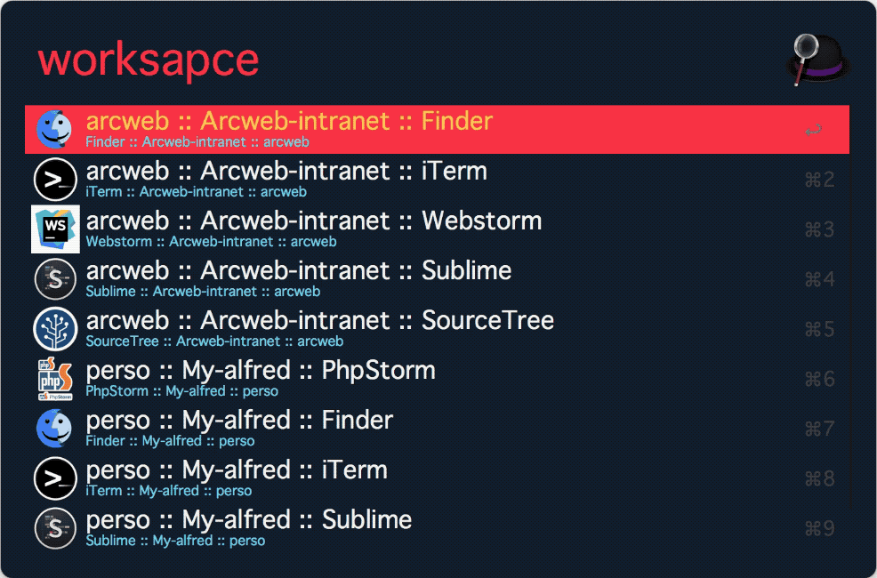

# Alfred Workspace
* Manage projects form Alfred,
* Quick-go to project folder or open a specific application like (sublime, chrome or terminal ...)

# Installation
### Clone repo

```
git clone 
```

### link to alfred workflows
```
ln -s `pwd`/alfred-workspace /Users/ach/Library/Application\ Support/Alfred\ 3/Alfred.alfredpreferences/workflows
```

# Usage
* Open app folder with your editor. ex: `code ./alfred-workspace`
* Go to ./projects folder and add your projects files.
* See projects_exemples folder for projects exemples

# Add More actions

see actions.lib.php

# demo



